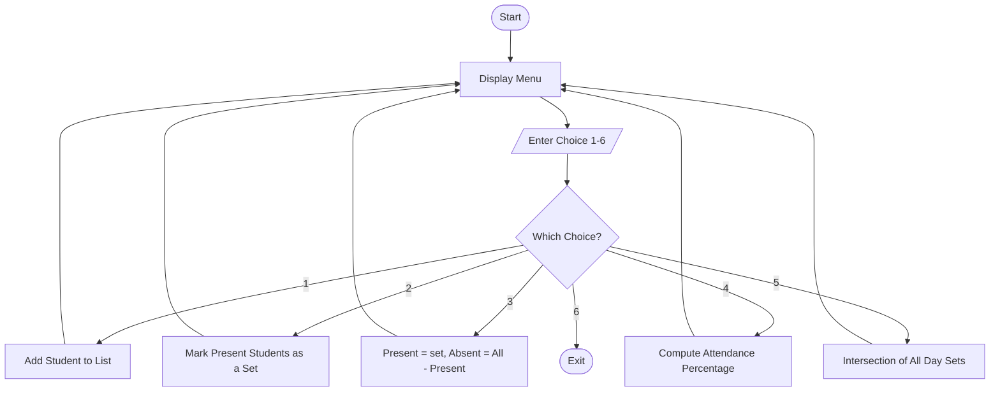

# Student Attendance Tracker

A menu-driven console application to record daily attendance. Student names are
kept in a list, each day's present students are stored as a set, and set
operations are used to find absentees and students with perfect attendance.

## Flowchart



## Algorithm

```
Step 1 : Start.
Step 2 : Create an empty list students, an empty list day_names and an
         empty list day_records.
Step 3 : Display the menu with options 1 to 6.
Step 4 : Read the user's choice.
Step 5 : If choice = 1, read a name; if it is new append it to the
         students list, else show a message.
Step 6 : If choice = 2, read a day label and the present names, build a
         set of valid present students, then append the label to
         day_names and the set to day_records.
Step 7 : If choice = 3, read a day label; present = its set,
         absent = set(students) - present; display both.
Step 8 : If choice = 4, for each student count the sets that contain the
         student, then percentage = (present_count / total_days) * 100.
Step 9 : If choice = 5, take the intersection of all day sets to find
         students present on every day.
Step 10: If choice = 6, print goodbye message and stop.
Step 11: For any other choice, show "invalid choice".
Step 12: Repeat from Step 3 until the user chooses to exit.
Step 13: Stop.
```

## Sample Output

```
===== STUDENT ATTENDANCE TRACKER =====
1. Add Student
2. Mark Attendance
3. View Present/Absent for a Day
4. Attendance Percentage
5. Students Present on All Days
6. Exit
Enter your choice (1-6): 1
Enter student name: Amit
Amit added successfully.

Enter your choice (1-6): 2
Enter day label (e.g. Day1): Day1
Registered students: Amit, Riya, John
Enter names present (comma separated): Amit, Riya
Attendance recorded for Day1. Present: 2

Enter your choice (1-6): 3
Enter day label to check: Day1
Present on Day1: Amit, Riya
Absent on Day1: John

Enter your choice (1-6): 4
----- ATTENDANCE PERCENTAGE -----
Amit            2/2 days  ->  100.00%
Riya            1/2 days  ->  50.00%
John            1/2 days  ->  50.00%

Enter your choice (1-6): 5
Present on all days: Amit

Enter your choice (1-6): 6
Exiting Student Attendance Tracker. Goodbye!
```
## Author

Rajib Maldas
